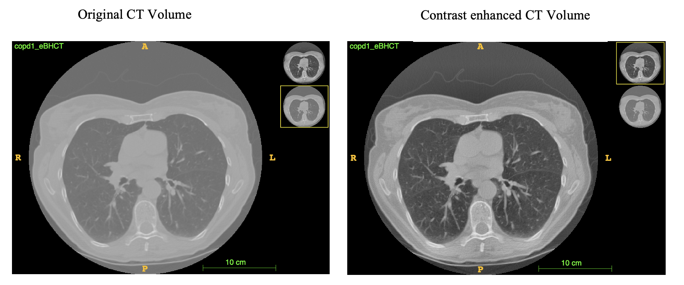
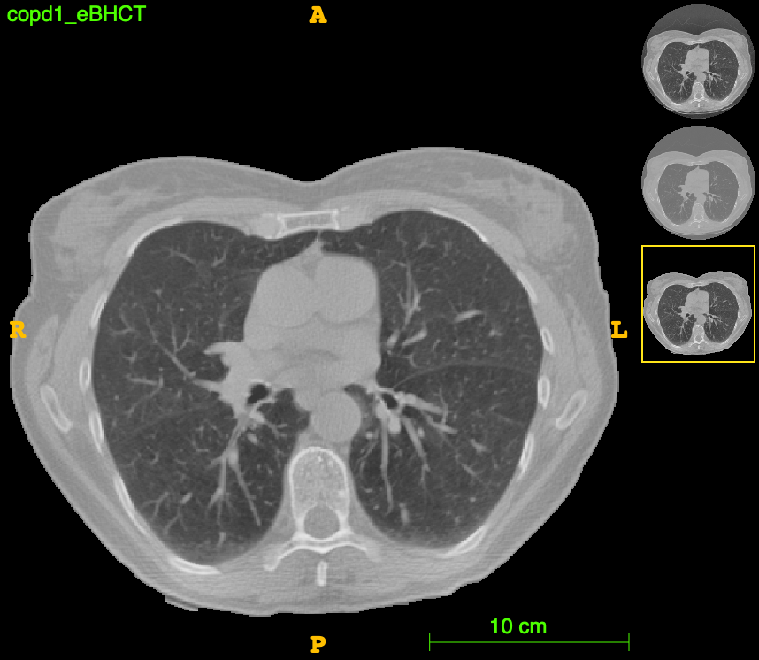
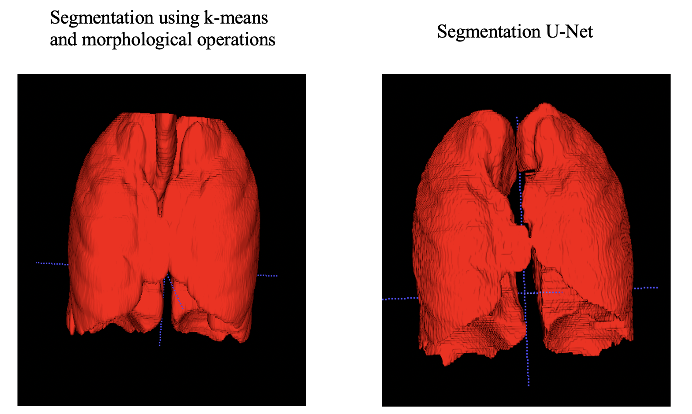

# Chest CT registration
This repository contains the code for registration of Chest CT done from inspiratory to expiratory breath-hold CT image pairs. The dataset used is [COPDGene](https://med.emory.edu/departments/radiation-oncology/research-laboratories/deformable-image-registration/downloads-and-reference-data/copdgene.html) dataset. The dataset has landmarks for all the inhale-exhale image pairs which are used to calculate the registration error.

## IMPORTANT DATA STRUCURE
The data must be organized as follows:
### Add at the top of the inhale landmarks .txt files the following rows:
```
index
300 (number of landmarks)
```
* This is necessary for transformix to be able to read the inhale landmarks .txt files correctly.

### Structure the data in our project folder
The data in the cwd() of the project must be in the following Path: `cwd()/data/YOUR_DATASET`

Inside your_dataset folder one folder is created for each patient MUST have the following name: `copdX`.
Iniside that folder per patient all the data of that patient is located:
* copdX_300_eBH_xyz_r1.txt
* copdX_300_iBH_xyz_r1.txt
* copdX_eBHCT.img
* copdX_iBHCT.img


## Setting up the environment
- Create a conda environment
```
conda create -n ctreg python==3.9.13 anaconda -y && conda activate ctreg
```
- Install the requirements
```
pip install -r requirements.txt
```

## Data preprocessing
### 1. Transformation of the dataset images from raw format to NIFTI format. 
The initial data is in the binary/raw format. The `read_raw.py` script assumes that the train data is in directory 
`data/train`  with the patient wise `.img` inhale and exhale files structured as `copd1`,`copd2`,...etc. Make sure that the metadata information such as image dimensions and voxel spacings are present in `copd_metadata.csv`.

- Run `python read_raw.py --dataset_option test`, to convert raw test images to  `nii.gz`.

### 2. Normalization and local contrast adjustment (CLAHE) of all the images.
In the `preprocessing/preprocessing.py`,file the `CT_normalization` function takes the inhale and exhale volumes and 
does Min-Max Normalization of the whole volume to scale it to the range of (-2000, 2000). Then the values that are greater 
than -2000 are again scaled but this time to the range of (-1000, 1000). This is made to ensure that the values of the voxels belonging 
to air are around -1000 (necessary for U-Net lung segmentation).
The `CT_normalization` function saves the images in a folder of  `<dataset_option>_<preprocessing_type>`. The preprocessing types available are Normalized, CLAHE and Normalized_CLAHE. From series of experiments, we have chosen Normalized CLAHE for our use case.



### 3. Gantry removal
`preprocessing/segment.py` performs gantry removal on the images. Gantry mask is obtained using k-means clustering followed by post-processing using morphological operations and area filtering of contours. The gantry removed images are saved in `data/<dataset_option>_gantry_removed`.


### 4. Segmentation of the lungs
Two methods have been implemented for segmentation of the lungs inside the gantry.
1. k-means based segmentation followed by morphological post-processing.
2. U-Net based segmentation adapted from https://github.com/JoHof/lungmask.

U-Net based segmentation, as expected, performs better. However, for any back-up cases our segmentation method can be used.



## Registration

### 1. Registration of the images (fixed image: inhale, moving image: exhale) using elastix.
By running the function call "elastix_batch_file" located in `utils/batchfilecreator.py`, a system file is created (.bat or .sh depending on the OS). This elastix file is ready to perform
the registration in the desired dataset folder. 
```
python utils/batchfile_creator.py --batch_type elastix --name_experiment_elastix NAME_EXPERIMENT --parameter
PARAMETER_FOLDER --dataset_option -DATASET --mask BOOLEAN --mask_name -MASK_NAME

```

### 2. Registration of the landmarks (fixed landmarks: inhale) using transformix
By running the function call "transformix_batch_file" located in `utils/batchfilecreator.py`, a system file is created (.bat or .sh depending on the OS). This elastix file is ready to perform
the transformation of the inhale landmarks aaplying the TransformationParameters that outputs the registration of 
the images performed by elastix.
```
python utils/batchfile_creator.py --batch_type transformix --name_experiment_elastix NAME_EXPERIMENT
--parameter PARAMETER_FOLDER --name_experiment_transformix -name_experiment_transformix
--dataset_option -DATASET
```

## Compute the metrics
If the exhale landmarks .txt file is provided to check the result coming from the transformation of the inhale
landmarks. Running the following line of code will create a .csv file in `cwd()/metrics` computing the mean TRE and std
TRE per patient and the mean and std of all patients.
```
python utils/metrics.py --folder_experiment_landmarks -FOLDER_NAME_OUTPUT_TRANSFORMIX

```